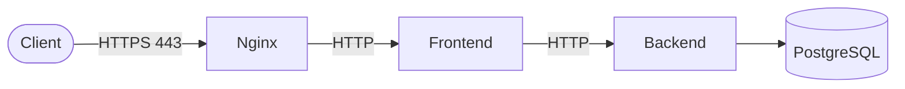

# Kpata — Infrastructure

Deployment infrastructure for **Kpata**, a booking platform connecting customers with
hair & beauty salons in Côte d'Ivoire. This repository orchestrates the frontend,
backend and database behind an Nginx reverse proxy with HTTPS termination, using
Docker Compose.


## Table of contents

- [Overview](#overview)
- [Architecture](#architecture)
- [Tech stack](#tech-stack)
- [Getting started](#getting-started)
- [Environment variables](#environment-variables)
- [CD pipeline](#cd-pipeline)
- [Project status](#project-status)

## Overview

This repo does not contain application code — it defines how the [`kpata-frontend`](https://github.com/KyliannIvory/kpata-frontend)
and [`kpata-backend`](https://github.com/KyliannIvory/kpata-backend) images are run
together with a PostgreSQL database, behind Nginx acting as reverse proxy and TLS
terminator.

## Architecture



- Nginx redirects all HTTP (`:80`) traffic to HTTPS (`:443`) and terminates TLS using
  certificates mounted from `nginx/certs/`.
- Frontend and backend communicate over the internal Docker network `kpata_network`;
  only Nginx's ports are published to the host.

## Tech stack

| Layer | Technology |
|---|---|
| Reverse proxy | Nginx 1.31 (Alpine), TLS termination |
| Frontend | Next.js app ([`kpata-frontend`](https://github.com/KyliannIvory/kpata-frontend)), image pulled from GHCR |
| Backend | Spring Boot API ([`kpata-backend`](https://github.com/KyliannIvory/kpata-backend)), image pulled from GHCR |
| Database | PostgreSQL 16 |
| Orchestration | Docker Compose |
| CD | GitHub Actions (manual dispatch, self-hosted runner) |

## Getting started

**Prerequisites:** Docker & Docker Compose.

```bash
# Create the external network shared with the other services
docker network create kpata_network

# Configure secrets
cp .env.example .env
# fill in DB_PASSWORD and JWT_SECRET

# Provide SSL certificates in nginx/certs/:
#   nginx/certs/kpata.local.crt
#   nginx/certs/kpata.local.key

docker compose up -d
```

The app is then reachable at `https://kpata.local` (add it to `/etc/hosts` pointing at
`127.0.0.1`, or your target server's IP).

## Environment variables

Read from `.env` (see `.env.example`):

| Variable | Purpose |
|---|---|
| `DB_NAME` | PostgreSQL database name |
| `DB_USERNAME` | PostgreSQL user |
| `DB_PASSWORD` | PostgreSQL password |
| `JWT_SECRET` | JWT signing key — must match what the backend expects |

## CD pipeline

[`.github/workflows/cd.yml`](.github/workflows/cd.yml) automates deployment to a
target server:

1. Checkout the repository
2. Write `.env` from GitHub Actions secrets
3. Log in to GHCR
4. Pull the latest images (`docker compose pull`)
5. Deploy (`docker compose up -d --remove-orphans`)
6. Prune unused images

It is triggered manually (`workflow_dispatch`) and runs on a **self-hosted** runner.

## Project status

**In place:**
- Local Docker Compose stack (Nginx, frontend, backend, PostgreSQL)
- HTTPS termination at Nginx with local certificates
- CD workflow defined, triggered manually

**Not yet in place:**
- No self-hosted runner registered — the CD workflow cannot currently run
- No target server (VPS) provisioned
- Images are deployed via the `:latest` tag rather than a pinned version/SHA, so
  rollback isn't reliable yet

**Known next steps:**
- Provision a VPS and register it as a GitHub Actions self-hosted runner
- Pin deployed image tags to a specific version/SHA
- Add a GitHub environment protection rule before allowing production deploys
